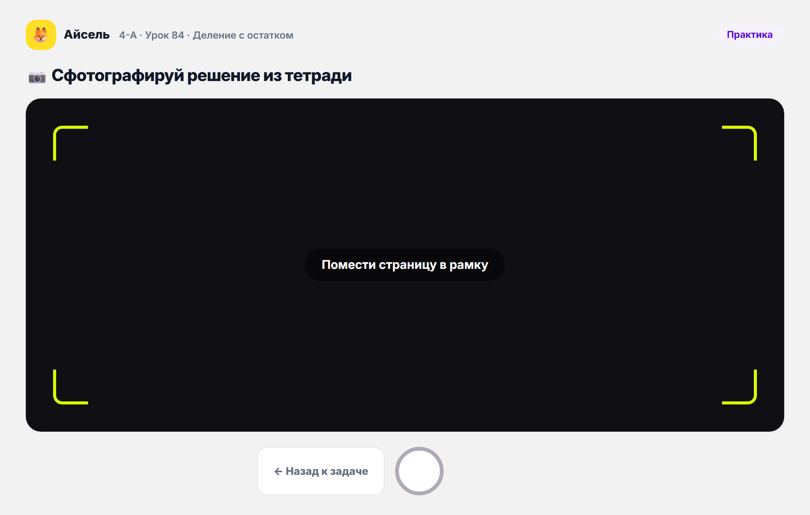
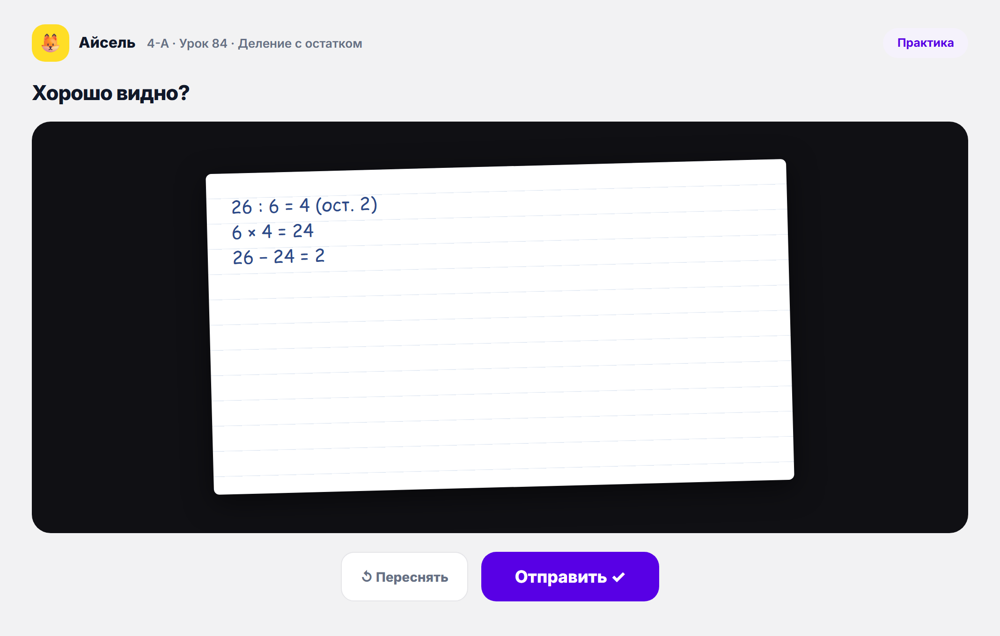

# Интерфейс ученика · Фаза 1

Описание интерфейса для технической команды. Формат каждого экрана:

1. **User story** — что делает пользователь и зачем (у экрана может быть несколько; в скобках — номер истории US-N из общего списка).
2. **Контент и действия** — что на странице и что можно сделать (дефолт для реализации); AC = критерии приёмки.
3. **Референс** — скрин из прототипа в режиме «Фаза 1» (опционально).

**Скоуп — Фаза 1.** Входит: полный цикл урока (4 фазы), задания в тетради с фото-отправкой, домашняя работа, прогресс. **Не входит** (Фаза 2 / позже): подсказка после ошибки (US-15), автопроверка и фидбек по домашке (US-25), звёзды/проценты решаемости в прогрессе (US-27), ИИ-разбор фото тетради (Vision), персональные треки A/B/C, буферный урок, диагностика, карта навыков.

**Сквозной контекст демо:** ученица **Айсель**, класс **4-А**, урок «Деление с остатком». Данные — мок.

**Язык.** Язык интерфейса (RU/AZ) **назначается ученику при создании учётной записи**; переключателя языка внутри приложения нет. Для рынка AZ интерфейс нужно локализовать (тексты статусов и кнопок).

**Допущение.** Соединение во время урока считаем идеальным — поведение синхронных этапов (разминка, блокировка, фронтальные) при потере связи в Ф1 не обрабатываем.

**Одно устройство — планшет (пока).** И классная, и домашняя работа в Фазе 1 идут на планшете; отдельного мобильного интерфейса для дома пока нет. Поэтому:
- **Стартовый экран — общий вход** для урока, домашки и прогресса; это **один и тот же экран** в любом контексте (US-23), меняется только статус карточек.
- **Урок управляется фазой:** в классе все переходы запускает учитель; свободной навигации в классе нет.
- **Домашняя работа — свободная навигация** с того же стартового экрана.

> **Про скрины-референсы.** Скрины урока — в планшетном (ландшафтном) виде. Скрины старта/домашки пока в старой телефонной рамке, скрины фото-задания — из общего прототипа; всё будет переснято в планшетном Ф1-виде. Контент и действия от этого не меняются.

**Где Фаза 1 проще полного продукта:**
- Адаптива на стороне ученика нет — все решают **один и тот же стандартный набор** задач (без персональных треков).
- Фото тетради ученик снимает и отправляет, но **ИИ-разбор фото (Vision)** — позже; в Ф1 фото уходит учителю.
- Домашка **отправляется учителю** — без мгновенной автопроверки, фидбека и звёзд (Фаза 2).
- Прогресс — через **статусы тем** и факт сдачи ДЗ (без звёзд/процентов).

**Совпадающие экраны:** прежние «Ожидание урока» и «Домашняя главная» — это **один стартовый экран** (экран 1); карточка ДЗ на «Урок пройден» ведёт в тот же экран «Домашняя работа · решение».

---

## 1. Старт (один экран — и в классе, и дома)

**User stories.**
- US-1. Как ученик, я хочу видеть на старте своё имя, чтобы убедиться, что вошёл в свой аккаунт.
- US-2. Как ученик, я хочу видеть два раздела — «Классная работа» и «Домашняя работа», чтобы понимать, где какая активность.
- US-3. Как ученик, в блоке «Классная работа» я хочу видеть тему сегодняшнего урока, его номер и статус, чтобы понимать, что меня ждёт и на каком этапе мы находимся.
- US-4. Как ученик, я хочу видеть неактивное (серое) поле домашней работы, пока учитель её не назначил, чтобы понимать, что задание пока недоступно.
- US-5. Как ученик, я хочу видеть активную кнопку перехода к домашней работе с темой и дедлайном, когда учитель её назначил, чтобы вовремя начать.
- US-23. Как ученик, я хочу зайти с любого устройства и увидеть тот же стартовый экран (со статусом урока «Завершён»), чтобы продолжить работу дома.

**Контент и действия.**
- Это **один и тот же экран** в любом контексте; меняется только статус карточек.
- Шапка: имя ученика (US-1).
- Карточка **«Классная работа»** (US-3): тема урока, порядковый номер, статус.
  - AC: тема подтягивается по дате из тематического плана учителя.
  - AC: статус ∈ {«Урок ещё не начался», «Урок идёт», «Урок завершён»}.
- Карточка **«Домашняя работа»**:
  - пока учитель не назначил — **серое неактивное поле** (US-4);
  - назначена — **активная кнопка** с темой и дедлайном → экран 9 (US-5).
- Ссылка **«Мой прогресс»** (экран 11).

**Референс.**  — *текущий скрин в телефонной рамке и без статусов; финальный экран на планшете покажет статус урока и состояние карточки ДЗ.*

---

## 2. Урок · Разминка

**User stories.**
- US-6. Как ученик, я хочу, чтобы после старта урока учителем мне стала доступна разминка, чтобы включиться в работу.
- US-7. Как ученик, я хочу решить задание разминки и отправить ответ, чтобы участвовать вместе с классом.
- US-8. Как ученик, я хочу после нажатия учителем «Показать ответы» увидеть результат, чтобы оценить себя и сравнить с классом.
- US-9. Как ученик, я хочу видеть индикатор прогресса внутри разминки, чтобы понимать, сколько заданий пройдено и сколько осталось.
- US-10. Как ученик, я хочу видеть метку этапа «Разминка», чтобы ориентироваться в структуре урока.

**Контент и действия.**
- Метка этапа «Разминка» + индикатор прогресса фаз урока (US-10) и прогресс внутри разминки (US-9). AC: 3–4 задания.
- Разминка доступна **после старта урока учителем** (US-6).
- Задание с вариантами ответа; **одна попытка** — ученик выбирает и отправляет (US-7) → нейтральное «ответ отправлен, ждём разбор».
- По нажатию учителем **«Показать ответы»** (US-8):
  - AC: показывается, верно/неверно я ответил;
  - AC: правильный ответ показывается **всегда** — в том числе если я ответил верно с первой попытки;
  - AC: показывается распределение ответов по классу (тоже всем, независимо от своего ответа).

**Референс.**  · отправлено: [`02b-warmup-sent.png`](_screens_p1/02b-warmup-sent.png) · разбор: [`03-warmup-feedback.png`](_screens_p1/03-warmup-feedback.png)

---

## 3. Урок · Объяснение

**User stories.**
- US-11. Как ученик, я хочу, чтобы во время объяснения экран блокировался надписью «Смотрим на учителя», чтобы сфокусироваться и не отвлекаться.
- US-12. Как ученик, я хочу во время объяснения решать фронтальные задания, чтобы закреплять материал по ходу.

**Контент и действия.**
- Во время объяснения — заблокированный экран с замком и надписью **«Смотрим на учителя»** (US-11).
- Когда учитель открывает фронтальное задание этапа — оно появляется на планшете, ученик решает и отправляет (US-12).
  - AC: логика та же, что в разминке — **одна попытка**, все отправляют ответ → учитель открывает ответы → ученик видит верно/неверно, правильный ответ (всегда, даже при верном) и распределение по классу.

**Референс.** 

---

## 4. Урок · Самостоятельная практика

**User stories.**
- US-13. Как ученик, я хочу после объяснения перейти к индивидуальной практике, чтобы тренироваться самостоятельно.
- US-14. Как ученик, я хочу иметь до трёх попыток на каждое задание, чтобы было пространство исправить ошибку.
- US-16. Как ученик, я хочу после двух неверных ответов иметь кнопку «Позвать учителя», чтобы получить помощь.
- US-17. Как ученик, ожидая учителя, я хочу перейти к следующему заданию или попробовать ещё раз, чтобы не простаивать.

**Контент и действия.**
- Метка этапа «Практика» + индикатор фаз. Счётчик «Задача N из M · решено верно: …».
- Текст задачи, поле ответа, кнопка **«Проверить»** (детерминированная автопроверка). Стандартный набор для всех.
  - AC: количество заданий (M) **задаётся методистом при составлении курса** (не учителем, не хардкод).
- **До 3 попыток** на задание (US-14).
- После двух неверных попыток — кнопка **«Позвать учителя»** (US-16). AC: учитель получает сигнал на свой компьютер (карточка ученика подсвечивается на его live-карте, класс не видит).

*Подсказка после первой ошибки (US-15) — Фаза 2, в Ф1 не входит.*

**Референс.** 

---

## 5. Урок · «Не получается» (после «Позвать учителя»)

**User story.**
- US-17. Как ученик, ожидая учителя, я хочу перейти к следующему заданию или попробовать ещё раз, чтобы не простаивать.

**Контент и действия.**
- Экран-подтверждение, что сигнал ушёл: **«Учитель уже знает!»**.
- Кнопки: **«Попробую ещё раз»** / **«Подожду учителя»** (US-17).

**Референс.** 

---

## 6. Урок · Задание в тетради (фото)

**User stories.**
- US-18. Как ученик, я хочу видеть задания, требующие решения в тетради, с понятной формулировкой, чтобы решить их письменно.
- US-19. Как ученик, я хочу сфотографировать решение, загрузить изображение и проверить его перед отправкой, чтобы отправить учителю корректное фото.

**Контент и действия.**
- Часть практики: задание с понятной формулировкой, помеченное как «решаем в тетради» (US-18).
- **Съёмка/загрузка фото** решения (US-19).
  - AC: есть интерфейс загрузки изображения (камера).
  - AC: есть шаг предпросмотра/проверки фото перед отправкой (переснять / отправить).
  - AC: можно приложить **несколько фото к одному заданию** и **переотправить** после отправки; все версии сохраняются как **история** (на экране ученика — список версий с пометкой «последняя»; учителю на проверке доступна история, по умолчанию — самая свежая). *(D2, реализовано 2026-06-29)*
- После отправки фото уходит учителю.
  - AC: результат проверки фото ученику в Ф1 **нигде не показывается** — статус «на проверке → проверено» продумаем на следующих этапах.

*ИИ-разбор фото (Vision, локализация шага ошибки) — Фаза 2; в Ф1 фото просто уходит учителю.*

**Референс.** Камера:  · предпросмотр:  — *из общего прототипа; будут пересняты для Ф1.*

---

## 7. Урок · Рефлексия

**User story.**
- US-20. Как ученик, я хочу после практики (по запуску учителем) оценить, как для меня эмоционально прошёл урок, и отправить ответ, чтобы поделиться состоянием.

**Контент и действия.**
- Вопрос «Как тебе сегодняшний урок?» + эмодзи-шкала (Скучно / Так себе / Понравилось / Очень круто).
- Кнопка **«Отправить»**. Запускает фазу учитель; ответ уходит в его сводку рефлексии.

**Референс.** 

---

## 8. Урок · Итоги урока

**User stories.**
- US-21. Как ученик, я хочу после завершения урока учителем увидеть свои результаты, чтобы оценить, как прошёл урок.
- US-22. Как ученик, я хочу на экране итогов увидеть назначенное домашнее задание — тему и дедлайн, чтобы знать, что делать дома.

**Контент и действия.**
- Сводка результатов (US-21):
  - AC: сколько задач решено за урок;
  - AC: сколько из них верно с первой попытки;
  - AC: сколько решений осталось на проверке у учителя.
- Карточка **«Назначено домашнее задание»** — тема и дедлайн (US-22); **кликабельна**, ведёт к домашке (экран 9).

**Референс.** 

---

## 9. Домашняя работа · решение

**User story.**
- US-24. Как ученик, я хочу открыть домашнюю работу и решать набор заданий, аналогичных по логике практике, чтобы закрепить тему.

**Контент и действия.**
- Последовательное решение заданий (одно на экран), поле ответа, переход к следующему.
  - AC: задания **не идентичны** заданиям практики, но построены по той же логике решения.
  - AC: количество заданий **задаётся методистом при составлении курса**.
  - AC: **до 3 попыток** на задание, **без** кнопки «Позвать учителя» (в отличие от классной практики).
- После последнего задания работа отправляется учителю.

*Вход: с карточки домашки на старте (экран 1) или с экрана «Итоги урока».*

**Референс.** 

---

## 10. Домашняя работа · отправлена

**User story.**
- Как ученик, отправив домашку, я хочу убедиться, что она ушла, и понимать, когда узнаю результат.

**Контент и действия.**
- Подтверждение **«Домашка отправлена! Все N заданий отправлены»** + «Учитель проверит и даст обратную связь на уроке».
- Кнопка **«На главную»** (на старт, экран 1).

*Фидбек по правильности ДЗ (сколько верно/неверно, US-25) — Фаза 2; в Ф1 ученик результат сразу не видит.*

**Референс.** 

---

## 11. Мой прогресс

**User story.**
- US-26. Как ученик, я хочу открыть отдельный экран «Мой прогресс», чтобы видеть пройденные уроки и решённые домашние работы.

**Контент и действия.**
- **«Мои уроки»** — дорожка тем со статусами (пройдено / учим сейчас / откроется дальше). У пройденных — отметка «ДЗ сдано».
- Блок **«Пропущенные домашки»** (например, после болезни): тема, урок, дата, кнопка **«Догнать»**.

*Показатель решаемости звёздами/процентами (US-27) — Фаза 2; в Ф1 прогресс через статусы тем и факт сдачи ДЗ.*

**Референс.** 

---

## Решения по открытым вопросам (уточнено)

1. **Разминка/фронтальные:** распределение и правильный ответ показываются **всегда**, в том числе если ответил верно. На разминке и во фронтальной работе — **одна попытка**. *(см. экраны 2, 3)*
2. **Объём заданий** в практике и домашке — **задаётся методистом при составлении курса** (не учителем, не хардкод). *(см. экраны 4, 9)*
3. **Попытки в домашке:** **3 попытки** на задание, **без** вызова учителя. *(см. экран 9)*
4. **Фото-задания:** результат проверки фото ученику **пока нигде не показывается**; статус «на проверке → проверено» продумаем на следующих этапах. *(см. экран 6)*
5. **Связь во время урока:** соединение считаем **идеальным** — потерю связи на синхронных этапах в Ф1 не обрабатываем.
6. **Локализация:** нужна **AZ-локализация**; переключатель языка в приложении не нужен — **язык назначается ученику при создании учётной записи**.
